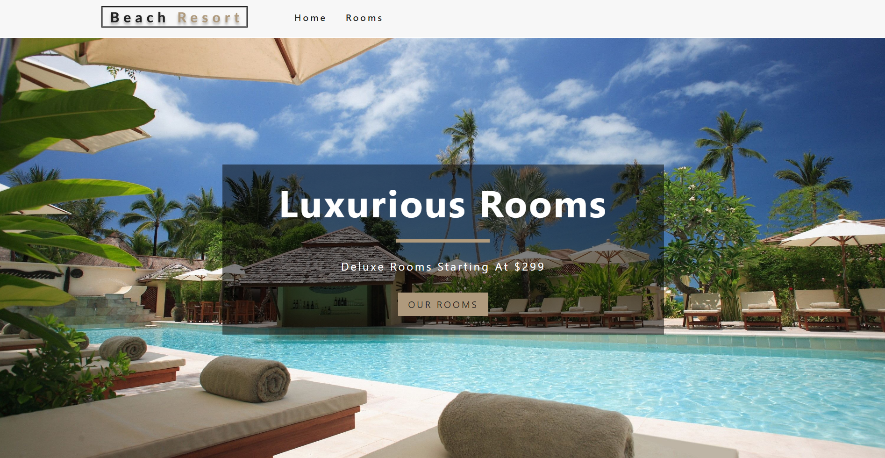

# ✨ Beach Resort | Hotel Room Booking System

In this repository is implemented `Complete 'Beach Resort' | Hotel Room Booking System - Web application`. Using `Node.js, Express.js,  MongoDB, React.js, Next.js, Redux.js, Ant Design & Tailwind CSS`.

<!-- contents of projects -->

## 🧑‍💻 Development Stack

- `Backend` - Node.js, Express.js & MongoDB Database
- `Admin Panel` - React.js, Redux.js, Ant Design & Tailwind CSS
- `Frontend` - Next.js, Redux.js & Ant Design

## ⛳️ Live Preview

- Admin Panel - [`🚀 Click to Visit`][admin-panel-link]
- Frontend (Client Side) - [`🚀 Click to Visit`][frontend-link]

<!-- live preview links -->

[admin-panel-link]: https://admin-beach-resort.vercel.app
[frontend-link]: https://mukul-beach-resort.vercel.app

